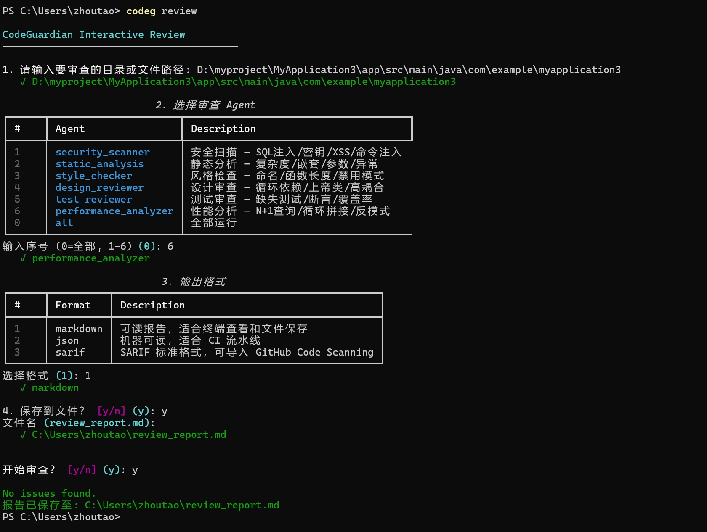

# CodeGuardian 交互模式

`codeg review` 不带任何参数即可进入交互模式，四步完成代码审查。

---

## 启动

```bash
codeg review
```

## 完整流程演示



---

## 第一步：输入路径

```
1. 请输入要审查的目录或文件路径: D:\myproject\src
   ✓ D:\myproject\src
```

- 支持绝对路径和相对路径
- 路径不存在会提示重新输入
- 用双引号包裹含空格的路径

---

## 第二步：选择 Agent

```
                          2. 选择审查 Agent
┌───┬──────────────────────┬──────────────────────────────────┐
│ # │ Agent                │ Description                      │
├───┼──────────────────────┼──────────────────────────────────┤
│ 1 │ security_scanner     │ 安全扫描 — SQL注入/密钥/XSS      │
│ 2 │ static_analysis      │ 静态分析 — 复杂度/嵌套/参数      │
│ 3 │ style_checker        │ 风格检查 — 命名/函数长度         │
│ 4 │ design_reviewer      │ 设计审查 — 循环依赖/上帝类       │
│ 5 │ test_reviewer        │ 测试审查 — 缺失测试/断言         │
│ 6 │ performance_analyzer │ 性能分析 — N+1查询/循环拼接      │
│ 0 │ all                  │ 全部运行                         │
└───┴──────────────────────┴──────────────────────────────────┘
输入序号 (0=全部, 1-6) [0]:
```

| 输入 | 效果 |
|------|------|
| `0` 或回车 | 六个 Agent 全部并行运行 |
| `1` | 只运行 Security Scanner |
| `2` | 只运行 Static Analysis |
| `3` | 只运行 Style Checker |
| `4` | 只运行 Design Reviewer |
| `5` | 只运行 Test Reviewer |
| `6` | 只运行 Performance Analyzer |

---

## 第三步：输出格式

```
                            3. 输出格式
┌───┬──────────┬────────────────────────────────────┐
│ # │ Format   │ Description                        │
├───┼──────────┼────────────────────────────────────┤
│ 1 │ markdown │ 可读报告，适合终端查看和文件保存   │
│ 2 │ json     │ 机器可读，适合 CI 流水线           │
│ 3 │ sarif    │ SARIF 标准，可导入 GitHub Scanning │
└───┴──────────┴────────────────────────────────────┘
选择格式 [1]:
```

| 格式 | 适用场景 |
|------|---------|
| markdown | 日常使用，人类阅读 |
| json | CI/脚本解析 |
| sarif | 导入 GitHub Code Scanning、SonarQube |

---

## 第四步：保存文件

```
4. 保存到文件？ [y/n]: y
文件名 [review_report.md]:
   ✓ D:\myproject\review_report.md
```

- 选 `n`：直接输出到终端
- 选 `y`：输入文件名，默认 `review_report.{ext}`
- 扩展名根据格式自动匹配（.md / .json / .sarif）

---

## 确认执行

```
────────────────────────────────────────
开始审查？ [y/n]: y
```

最后一步确认，选择 `n` 可取消。

---

## 等价命令对照

| 交互模式操作 | 非交互等价命令 |
|-------------|---------------|
| 路径 + 全部 Agent + markdown | `codeg review --path ./src --format markdown` |
| 路径 + 只选性能分析 + json | `codeg review --path ./src --only performance_analyzer --format json` |
| 路径 + 只选安全扫描 + 保存文件 | `codeg review --path ./src --only security_scanner --output report.md` |
| 选 Git diff | `codeg review --diff HEAD~3..HEAD` |
